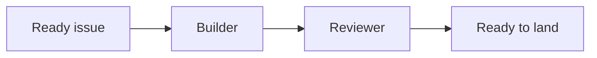

# Linear artifacts

Use Linear documents for durable work that does not fit cleanly in an issue description: cross-issue plans, design decisions, investigations, and substantial reviews. Issues remain the source of truth for executable scope, assignment, dependencies, and delivery status.

## Parent and update rules

The document-save capability supports create and update:

- Create by omitting the document ID and supplying exactly one parent.
- Update by supplying the existing document ID. Use full content for a planned rewrite or a patch for a narrow edit.
- Parent a cross-issue artifact to its project.
- Parent an issue-specific artifact to its issue.
- Do not pass a parent during an update unless the document should move; doing so reparents it.

Search first and keep one canonical document. Rely on Linear's document history rather than adding `v2`, `latest`, or `final` to the title. Store the returned document ID and URL in the related issue or handoff.

## Markdown that renders well

Linear converts Markdown into its rich-text editor. Use this stable subset:

- Keep each prose paragraph and list item on one source line. Use blank lines only between blocks; do not hard-wrap text, because some Linear write paths preserve those line breaks.
- `##` through `####` headings. The Linear document title acts as the page title.
- Bold, italic, strikethrough, inline code, links, and blockquotes.
- Bulleted lists, numbered lists, and task lists using `- [ ]` and `- [x]`.
- Fenced code blocks with a language when known.
- Pipe tables with a header row.
- `___` for a divider.
- Mermaid in a fenced `mermaid` block when a diagram makes a real relationship easier to understand.
- API-created collapsible sections with `+++ Section title`, followed by the content and a closing `+++`.

Use the actual Linear URL for an issue, project, or document when referring to it. Linear renders pasted Linear URLs as mentions. Do not invent mention syntax or type an unlinked identifier when the returned URL is available.

Avoid raw HTML, deeply nested lists, large decorative tables, emoji used as structure, and diagrams that repeat plain text. Do not use a collapsible section for scope, acceptance criteria, risks, or open questions; those must stay visible.

## Planning document template

Title the document `Plan — <outcome>`. Remove empty or irrelevant sections instead of leaving filler text. The artifact status describes the plan, not implementation progress; Linear issue statuses remain canonical for execution. In the Decisions table, a decision taken by an agent on the user's behalf carries "(open to veto)" until the user confirms it.

```markdown
- **Artifact status:** Draft
- **Owner:** Planner
- **Related work:** <project and issue links>
- **Last reviewed:** YYYY-MM-DD

---

## Outcome

<What will be true when this work succeeds.>

## Context

<Why this work exists and the evidence that shaped it.>

## Constraints

- <Constraint that affects the plan>
- <Explicit non-goal>

## Proposed approach

<The chosen approach and the key reasons for it.>

## Work breakdown

| Work item | Outcome | Depends on | State |
| --- | --- | --- | --- |
| <issue link or proposed title> | <checkable result> | <issue link or None> | Proposed |

## Validation strategy

- [ ] <Check that proves the outcome>
- [ ] <Real-product or integration evidence if needed>

## Risks and tradeoffs

| Risk or tradeoff | Impact              | Response                      |
| ---------------- | ------------------- | ----------------------------- |
| <risk>           | <what could happen> | <mitigation or accepted cost> |

## Open questions

- [ ] <Decision needed, owner, and when it blocks work>

## Decisions

| Date       | Decision   | Reason |
| ---------- | ---------- | ------ |
| YYYY-MM-DD | <decision> | <why>  |

+++ Supporting details

<Research notes, alternatives, or other detail that should not obscure the active plan.>

+++
```

Add a Mermaid block only when sequence, ownership, or dependencies are hard to scan in prose:

````markdown

````

## Keeping the artifact current

- Planner: create the document after the structure is approved, then replace proposed rows with the Linear issues and URLs that were actually created.
- Builder: read the document before work, but keep active status, blockers, and validation evidence on the issue. Report contradictions instead of silently rewriting the plan.
- Reviewer: review against the issue contract and linked artifact. Put concise findings on the issue; create a review document only for a report that needs durable sections or several linked findings.
- Owner: mark the artifact `Approved`, `Superseded`, or another plain state when making that decision, and link its replacement when superseded.

After saving, read the document back and confirm the content, parent, and URL. Then check that related issues link the canonical artifact without duplicating it.
